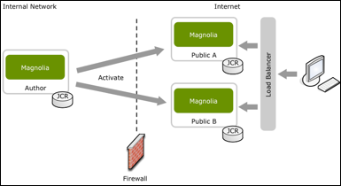

## 1.1	Author and Public Web

In the CMS there is an Author and a Public area. New content and all changes are made on the Author Web and then published onto the Public Web.

*This graph is showing the basic installation for a Magnolia Web that contains an Author and in this case 2 Public Webs for “Load Balancing”.*

**Note: Editing is done on the author web. Public browsing is done on the public web.**  
Generally, one should always login via the link https://magnoliadomain.example.com and navigate to the Webs as required.  

**There is also an option to open the required Magnolia instances directly:**  
Link to the Author Web: https://magnoliadomain.example.com/cmsAuthor/  
*Web to create new pages or to edit existing content.*

Copyright (©) 2017 **GateB AG** All Rights Reserved. :fire:
