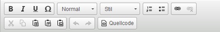
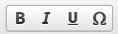
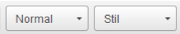
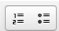
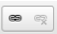
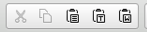
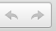
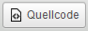

## 2.11 Editor

The editor shows more or less features depending on the page type that is selected.

*Format text.*

*Format templates such as Titles/Überschriften 2-6 and normal*

*Bullets with numbers or points*

*Insert links into the content/text. Also press this button to edit a link.*

*Copy and paste text. Best is to use the `plain text` button when inserting.*

*Undo and restore of edits.*

*Switch from Editor to HTML view.*

Copyright (©) 2017, GateB, All Rights Reserved.
